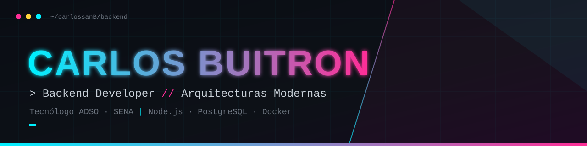

<div align="left">



</div>

<br>

<div align="right">


</div>

## `> whoami`

```js
const carlos = {
  usuario:   "carlossanB",
  rol:       "Backend Developer",
  formacion: "Tecnólogo en Análisis y Desarrollo de Software (SENA)",
  enfoque:   ["Arquitecturas Backend Modernas", "Automatización de flujos", "Optimización de bases de datos"],
  mantra:    "Automatizar lo repetitivo, estructurar lo complejo y optimizar lo existente.",
};
```

> Construyo la lógica que nadie ve pero todo el mundo usa: APIs limpias, bases de datos eficientes y procesos automatizados de principio a fin, pensados para escalar en el mundo real.

<br>

## `> stack --list`

**Base web**
<br>


<div align="right">

**Frontend**
<br>


</div>

**Backend core** &nbsp;`// mi especialidad`
<br>


<div align="right">

**Bases de datos**
<br>


</div>

**DevOps y herramientas**
<br>


<br>

## `> git stats`

<p align="left">
  
</p>

<p align="right">
  
</p>

<br>

## `> contact --open`

<a href="https://wa.me/573174876909?text=Hola%20Carlos%2C%20vi%20tu%20perfil%20de%20GitHub">
  
</a>
<a href="c4798175@gmail.com">
  
</a>

<br>

<div align="center">


</div>
